# Jetpack Compose Practice 🚀

Welcome to my **Jetpack Compose Practice** project!  
This repository is dedicated to exploring and experimenting with **Jetpack Compose** by replicating UI challenges, recreating the look and feel of famous apps, and promoting the use of Compose for **Android Development** and **Kotlin Multiplatform**.

---

## 📱 About the Project

- Practice building modern UIs with **Jetpack Compose**.
- I'm using **Navigation 3** to move between screens properly. If you run this project, you can see the screens by yourself.
- Replicate **popular app designs** and **UI challenges**.
- Showcase how Compose can simplify and enhance Android development.
- Explore **Kotlin Multiplatform** possibilities for sharing UI logic across platforms.

---

## 🎯 Goals

- Strengthen my understanding of **Jetpack Compose**.
- Build a collection of reusable **UI components**.
- Demonstrate Compose’s flexibility in replicating **real-world app designs**.
- Encourage developers to adopt Compose for **cross-platform projects**.

---

## 🛠️ Tech Stack

- **Kotlin**  
- **Jetpack Compose**
- **Compose Navigation 3**
- **Android Studio**  
- **Kotlin Multiplatform (KMP)**  

---

## 📸 Screenshots

Please Check the directory `screens/` to see each screen implementation.
<table>
  <tr>
    <td><b>Birthday Card</b></td>
    <td><b>Article</b></td>
  </tr>
  <tr>
    <td>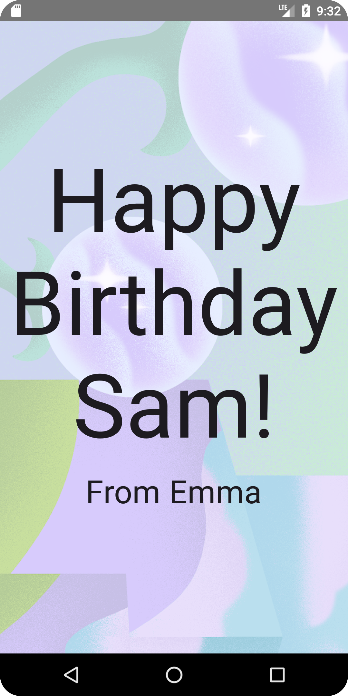</td>
    <td>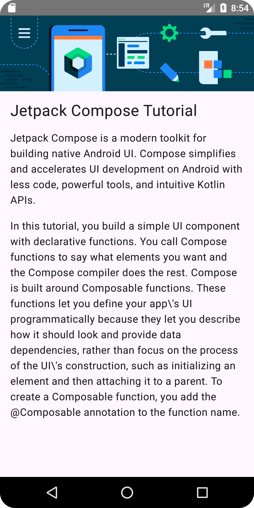</td>
  </tr>
  <tr>
    <td><b>Checklist Done</b></td>
    <td><b>Quadrants</b></td>
  </tr>
  <tr>
    <td>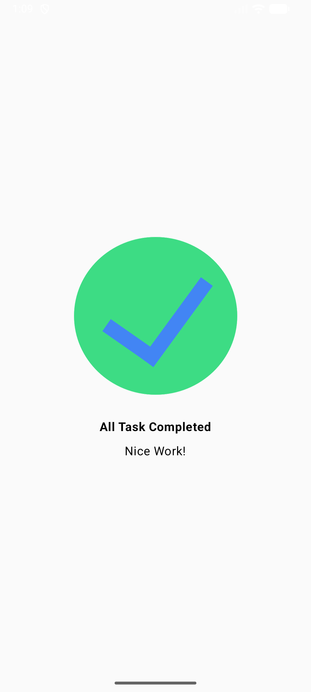</td>
    <td>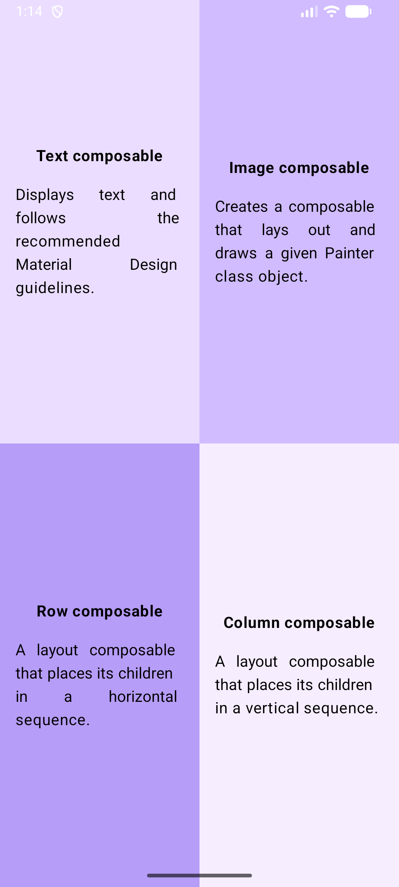</td>
  </tr>
  <tr>
    <td><b>Contacts Card</b></td>
    <td><b>Taximeter</b></td>
  </tr>
  <tr>
    <td>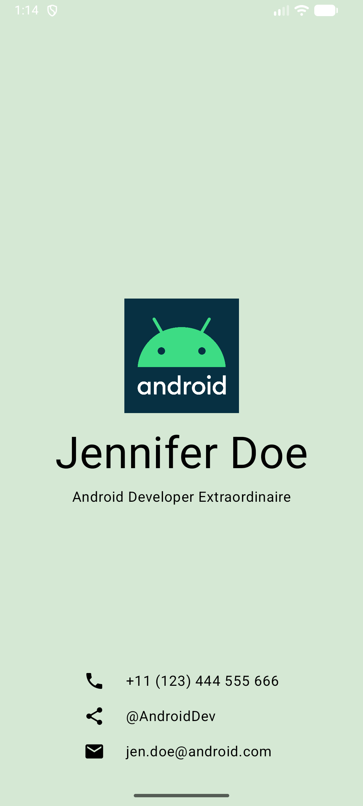</td>
    <td>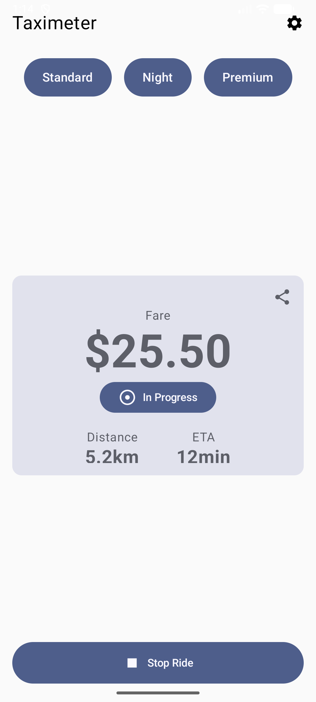</td>
  </tr> 
  <tr>
    <td><b>Basic Dashboard</b></td>
    <td><b>Dice Roller</b></td>
  </tr>
  <tr>
    <td>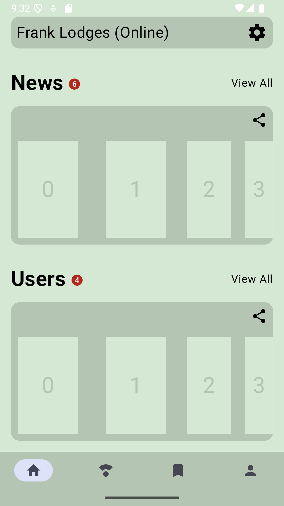</td>
    <td>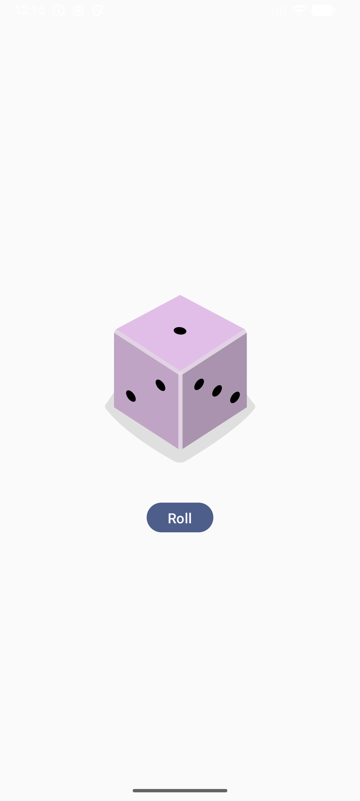</td>
  </tr>
  <tr>
    <td><b>Lemonade</b></td>
    <td><b>Magic</b></td>
  </tr>
  <tr>
    <td>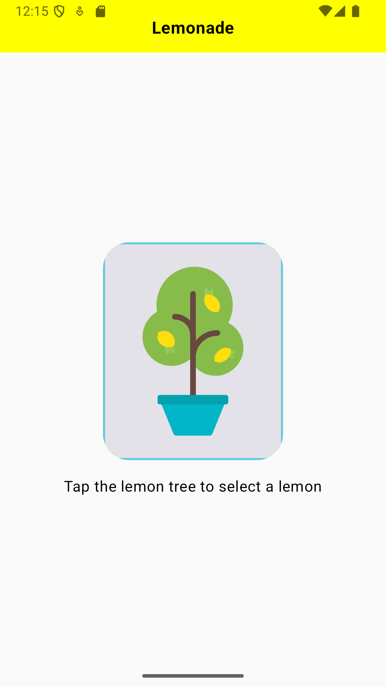</td>
    <td>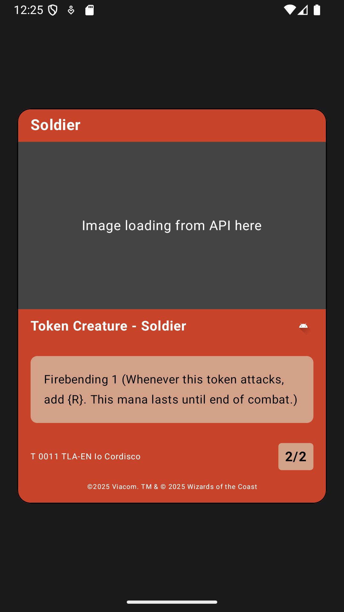</td>
  </tr>
  <tr>
    <td><b>Masonry List</b></td>
    <td><b>Tip Calculator</b></td>
  </tr>
  <tr>
    <td>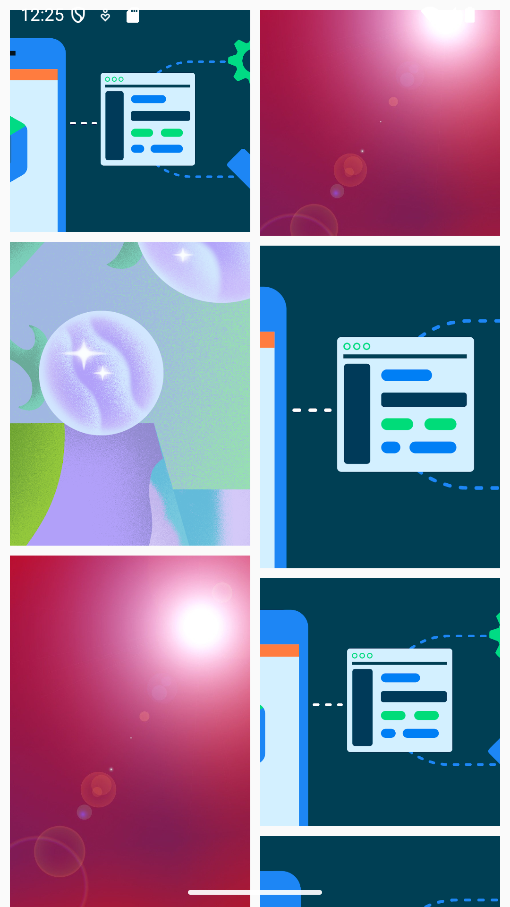</td>
    <td>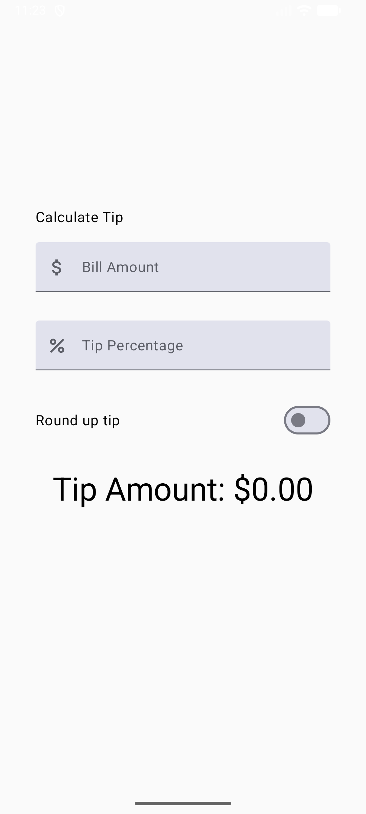</td>
  </tr>
  <tr>
    <td><b>Error Screen</b></td>
    <td><b></b></td>
  </tr>
  <tr>
    <td>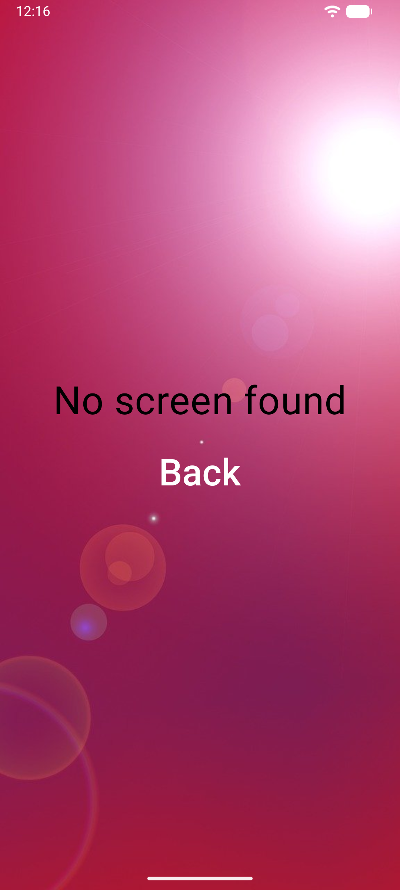</td>
    <td></td>
  </tr>
</table>

---

## 🤝 Contributing

This is a personal practice project, but contributions, ideas, and suggestions are welcome! Feel free to open issues or submit pull requests.

---

## 📢 Disclaimer

This project is for educational purposes only. All replicated designs are inspired by existing apps and UI challenges, but no proprietary assets or code are used.

---

## ⭐ Support

If you find this project helpful or inspiring:

- Give it a ⭐ on GitHub
- Share it with other developers exploring Jetpack Compose

---

## 📚 Resources

- **Jetpack Compose Documentation**
- **Kotlin Multiplatform**
- **Jetpack Compose**
- **Compose Navigation 3**
- **Android Developers YouTube**  

---
